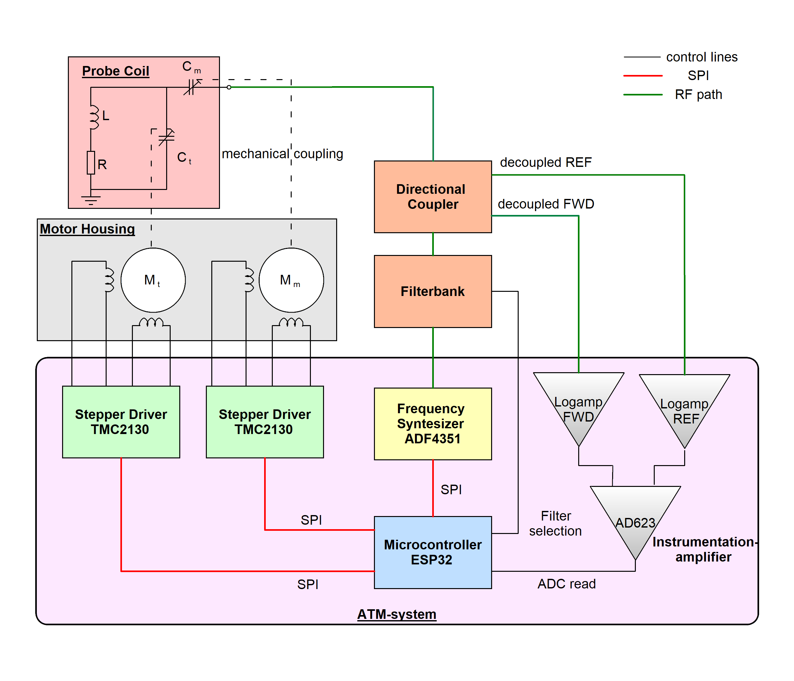
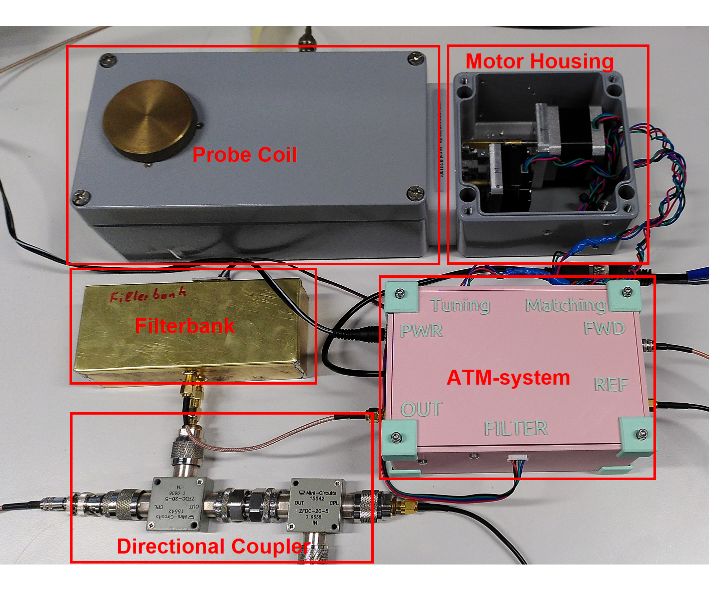

# ATM
## Stepper-based Automated Tuning and Matching

Tuning and Matching of the resonator coil is an essential part of Nuclear Quadrupole Resonance (NQR) spectroscopy. Because unknown samples are often scanned over large frequency ranges, Tuning and Matching has to be performed frequently. For high Q probe coils using mechanically trimmable capacitors, this is a long and tedious task.
To overcome this issue, an automatic Tuning and Matching system was developed using widely available low-cost components. Stepper drivers control mechanically trimmable capacitors and a microcontroller measures the Return Loss at resonance frequency. The system is capable of Tuning and Matching of a resonator coil in a frequency range from 75 to 125 MHz. It can also measure the Return Loss of the probe coil at its resonance frequency. Therefore, a foundation has been laid for future implementation of broadband NQR scans using mechanical probe coils.

## What works
- Homing of the probe coil using the sensorless load detection of TMC2130 stepper drivers. 
- A mechanically tunable probe coil can be tuned and matched in the frequency range of 75-125MHz.
- The Return Loss at single frequencies can be measured. 
- The current resonance frequency of the probe coil can be measured. 

## System overview
The ATM-system consists of multiple separate hardware components and multiple signal paths. One signal path is used to measure the reflection (characterized by the Return Loss) at a frequency with a fixed position for the tuning and matching capacitors. It is structured as following:

1.  A frequency synthesizer outputs an RF signal to a filterbank. 
2. The filterbank filters out harmonic components of the frequency \break synthesizer's output.
3. The filtered signal is guided to a directional coupler setup. The directional coupler is connected to the resonator circuit and decouples the forward signal and the signal reflected at the resonator circuit. 
4. The forward and reflected signals are converted to a DC signal using a logarithmic amplifier. 
5. An instrumentation amplifier takes the DC signals of the forwarded and reflected signal as differential inputs and outputs an amplified signal.
6. An ADC reads in the output of the instrumentation amplifier, which is a representation of the amplitude of the reflected wave. 

Since the system also needs to be able to adjust the mechanically trimmable capacitors, stepper motors have to be controlled.

1. A microcontroller sends commands to two stepper drivers using a Serial Peripheral Interface (SPI).
2. Those stepper drivers control the steppers which are mechanically coupled to the the tuning and matching capacitors of the probe coil.  

## Hardware
Schematics for the electrical circuit and mechanical housing can be found in the project directory. 

## Install instructions
1. Download the project as a zip file and import it as a platformio project. 
2. Connect your ESP32 microcontroller to your PC and flash the firmware onto it. 

# Commands
The user can input different commands to the ATM-system using the serial interface of the ESP32. The general structure of such a command is a single character followed by a float value. The float value is only needed for certain commands as specified in the following table. 

| Command Name | Character | Float Value | Float Range|
| :---        |    :----:   |          ---: |          ---: |
| Homing Routine | h | No | - | 
| Frequency Sweep | f | No | - |
| Iterative Resonance Tuning  | b | Yes | 35.0-260.0 |
| Measure Return Loss | r | Yes | 35.0-260.0 |
| Matching | m | Yes | 10.0-100.0  |
| Calibrate | c | No | - | 
| Automatic Tuning and Matching| d | Yes | 35.0-260.0 |

## Future work
- Optimization for broadband NQR measurments.
- Implementation of electrical Tuning and Matching using varactor diodes.
- Automatic calibration to new probe coils. 

## References
- [adf4351](https://github.com/dfannin/adf4351) by David Fannin was modified to be used with an ESP32 microcontroller. 
- [TMC2130Stepper](https://github.com/teemuatlut/TMC2130Stepper) by teemuatlut was used for the TMC2130 Stepper drivers.
- [ArduiTaM](https://doi.org/10.5194/mr-1-105-2020) by Jouda et al. was an inspiration for the implementation. 

