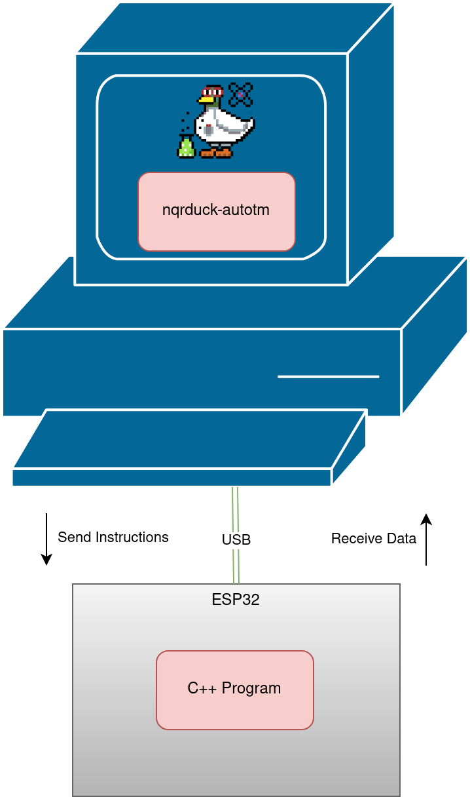

# ATM (Automatic Tuning and Matching) System

## Automated Tuning and Matching

Tuning and Matching of the resonator coil is an essential part of Nuclear Quadrupole Resonance (NQR) spectroscopy. Because unknown samples are often scanned over large frequency ranges, Tuning and Matching has to be performed frequently. For high Q probe coils using mechanically trimmable capacitors, this is a long and tedious task.
To overcome this issue, an automatic Tuning and Matching system was developed using widely available low-cost components. Stepper drivers control mechanically trimmable capacitors and a microcontroller measures the Return Loss at resonance frequency. The system is capable of Tuning and Matching of a resonator coil in a frequency range from 75 to 125 MHz. It can also measure the Return Loss of the probe coil at its resonance frequency.

Additionally the system is capable of Tuning and Matching of NQR probe coils using varactor diodes. In this case the system can output a Tuning and Matching voltage in a range from 0 to 5V. 

This system is best used in combination with the [NQRduck](https://github.com/nqrduck) project which provides a graphical user interface for the ATM-system. Specifically, the [nqrduck-autotm](https://github.com/nqrduck/nqrduck-autotm) module is used to control the ATM-system.

The C++ program is then running on the ESP32 microcontroller. The NQRduck autotm module communicates with the ESP32 microcontroller using the USB interface.

## Features
- Homing of the probe coil steppers using the sensorless load detection of TMC2130 stepper drivers. 
- A mechanically tunable probe coil can be tuned and matched in the frequency range of 75-125MHz.
- $S_{11}$ measurements can be performed at a frequency with a fixed position for the tuning and matching capacitors.
- Electrically tunable probe coils can be tuned and matched in the frequency range of 75-125MHz. 

## System overview
The ATM-system consists of multiple separate hardware components and multiple signal paths. One signal path is used to measure the reflection (characterized by the Return Loss) at a frequency with a fixed position for the tuning and matching capacitors. It is structured as following:

1.  A frequency synthesizer (ADF4351) outputs an RF signal to a filterbank. 
2. The filterbank filters out harmonic components of the frequency synthesizer's output.
3. The filtered signal is guided to a directional coupler setup. The directional coupler is connected to the resonator circuit and decouples the forward signal and the signal reflected at the resonator circuit. 
4. The forward and reflected signals are converted to a DC signal us an AD8302.
5. An ADC reads in the output of the AD8302 and calculates the Return Loss.

Since the system also needs to be able to adjust the mechanically trimmable capacitors, stepper motors have to be controlled.

1. A microcontroller sends commands to two stepper drivers using a Serial Peripheral Interface (SPI).
2. Those stepper drivers control the steppers which are mechanically coupled to the the tuning and matching capacitors of the probe coil.  

For electrically tunable probe coils the ESP32 uses the ADAC click to output a voltage to the varactor diodes.

## Hardware
Schematics for the electrical circuit and mechanical housing will be added soon. 

## Install instructions
1. Download the project as a zip file and import it as a platformio project. 
2. Connect your ESP32 microcontroller to your PC and flash the firmware onto it. 

For the installation of the NQRduck autoTM module please refer to the [NQRduck](https://github.com/nqrduck) documentation.

# Commands
The user can input different commands to the ATM-system using the serial interface of the ESP32. The general structure of such a command is a single character followed by a float value. The float value is only needed for certain commands.

# Results
A mechanically tunable probe coil was tuned and from 83MHz to 87MHz with a step size of 0.1MHz. The resulting reflection coefficient was then measured using the VNA (ZVL3, Rohde & Schwarz, Munich, Germany). The measured values were plotted using Matplotlib.

For the electrically tunable probe coil the probe coil was tuned and matched from 83 to 84MHz with a step size of 0.1MHz. The resulting reflection coefficient was then measured using the VNA (ZVL3, Rohde & Schwarz, Munich, Germany). The measured values were plotted using Matplotlib.

## Future work
- Optimization for $S_{11}$ measurements. Right now the maximum achievable matching is about -25dB.
- Improve the calibration for $S_{11}$ measurements. Right now the setup is very impractical. 

## References
- [adf4351](https://github.com/dfannin/adf4351) by David Fannin was modified to be used with an ESP32 microcontroller. 
- [TMC2130Stepper](https://github.com/teemuatlut/TMC2130Stepper) by teemuatlut was used for the TMC2130 Stepper drivers.
- [AD5593R](https://github.com/LukasJanavicius/AD5593R-Arduino-ESP32-Library) by LukasJanavicius was used for the AD5593R ADC.
- [ArduiTaM](https://doi.org/10.5194/mr-1-105-2020) by Jouda et al. was an inspiration for the implementation. 
